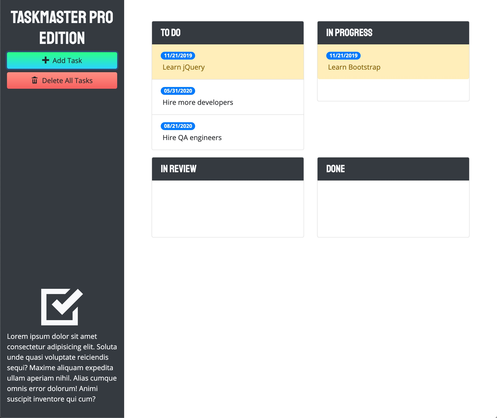

# Taskmaster Pro

## Description
Module 5 | Project
A company called Taskmaster has recruited you to expand their task-management application. To do this, you'll need to work with their existing codebase, which was built using jQuery, a third-party JavaScript library that simplifies DOM manipulation, and the front-end CSS library Bootstrap.

## Table of Contents
* [Learning Objectives](#learning-objectives)
* [Usage](#usage)
* [Mock Up](#mock-up)
* [Links](#links)
* [Tools](#tools)
* [Skills Learned](#skills-learned)
* [Credits](#credits)

## Learning Objectives
* Explain the difference between jQuery and JavaScript
* Explain the difference between CSS and Bootstrap
* Explain and implement libraries with content delivery networks and static files
* Perform DOM traversals and manipulations with jQuery
* Explain how to resolve issues related to dynamically generated HTML using jQuery
* Explain and implement the Bootstrap grid layout in HTML
* Integrate Bootstrap components in HTML files to quickly build user interfaces
* Add custom styling to a CSS framework
* Implement custom fonts and icons via CDNs

## Usage
Employee Task-Management Application

## Mock Up
The following mock up image shows required display:

## Links
### Links that Helped me along the way:
* [javascriptbook](https://javascriptbook.com/code/)
* [W3Schools - Bootstrap](https://www.w3schools.com/bootstrap/default.asp)
* [W3Schools - jQuery UI](https://www.w3schools.com/jquery/default.asp)
* [W3Schools - Moment.js](https://www.w3schools.com/jsref/jsref_sethours.asp)
* [W3Schools - Google Fonts](https://www.w3schools.com/css/css_font_google.asp)
* [W3Schools - Open Iconic](https://www.w3schools.com/howto/howto_css_icon_bar.asp)

## Tools
* Bootstrap 
- is an open source responsive front-end component library for developing with HTML, CSS, and JS. It uses a responsive grid system to allow for quick layouts in both development and production.
* jQuery
- is the most popular JavaScript library in the world. It simplifies DOM traversal and manipulation, event handling, and animation with an easy-to-use API.
* jQuery UI
- is a set of user interface interactions, effects, widgets, and themes built on top of the jQuery library, providing features such as drag and drop functionality and a date picker.
* jQuery UI Touch Punch
- is a small library that enables the use of touch events on sites using the jQuery UI library. This allows developers to use jQuery UI to create interfaces for mobile and touch devices.
* Moment.js
- is an open source JavaScript library that removes the need to use the native JavaScript Date object directly, making the Date object easier to parse, validate, and display.
* Google Fonts
- is a library of over 900 free licensed fonts, with an API for conveniently adding the fonts to your web application.
* Open Iconic
- is an open source icon font set that can help add meaning to elements of your website.

### Skills Learned
* Implement third-party libraries such as Bootstrap, jQuery, and Moment.js
* Perform DOM traversals and manipulations with jQuery
* Use jQuery to save user input in local storage
* Work with the Bootstrap grid layout in HTML
* Work with Bootstrap components
* Add custom color styles to an existing CSS framework
* Work with custom fonts and icons via a content delivery network (CDN)

## Credits
* GitHub: [Brian Lockhart](https://github.com/bslockhart/Taskmaster-Pro)
* GitHub: [Deployed Application](https://bslockhart.github.io/Taskmaster-Pro)

